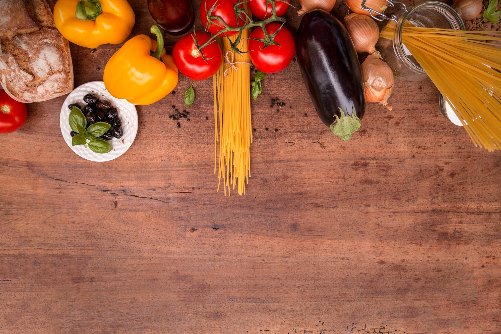

È da circa un anno che seguo una dieta specifica per l’**endometriosi**. 
Gli effetti indesiderati della terapia ormonale che stavo seguendo (ormai da troppi anni) avevano iniziato a preoccuparmi. Così ho cercato di capire se esistessero *alternative alla pillola* per gestire la progressione della malattia, o perlomeno per riuscire a non avere troppi dolori, a vivere una vita il più serena possibile. 

È così che ho scoperto che c’era una concreta possibilità che quello che mangiavo potesse influire sul modo in cui mi sentivo. Bè, non è stata realmente una scoperta. 
Lo sanno tutti (o no?) quanto sia importante una *corretta alimentazione*. Ma in quanti poi lo fanno davvero? In realtà mi ero imbattuta in un qualche articolo che parlava di dieta per l’endometriosi anche qualche anno fa. Dopo aver letto la lista di alimenti che avrei dovuto escludere...sono scoppiata a ridere e ho lasciato perdere, convinta non fosse possibile per una come me (che ama il pane, la pasta, i dolci, la Nutella) seguire una dieta del genere. Con la pillola, tutto sommato, stavo bene (all'epoca). Perchè prendersi il disturbo di fare così tante rinunce?
Eppure, a distanza di tempo, eccomi qui, con qualche anno in più e con una maggiore consapevolezza del mio corpo e del mio benessere. 

> Ma torniamo a noi, a questa dieta.   
> Mi trovavo in un momento della mia vita in cui non mi costava assolutamente nulla provare. Così mi son detta: facciamolo. 

Ed ecco allora che ho cominciato a fare ricerche più approfondite, a mettere insieme cibi sì e cibi no, a cercare di capirci qualcosa. Bè, ciò che ho trovato a dire il vero mi ha un po’ sconcertato. 
Vi riporto qui di seguito la lista di tutti gli alimenti che, stando ai vari siti internet e libri che ho letto, bisognerebbe eliminare se si soffre di endometriosi. 
*Ho riunito tutti quelli che sono stati nominati come ‘dannosi’ da almeno una delle fonti che ho trovato in giro (in italiano o in inglese)*.

- Alcool
- Caffeina, teina, bibite gassate
- Carne rossa
- Carboidrati raffinati
- Latte e latticini
- Zuccheri e dolcificanti
- Grano (frumento)
- Alimenti ricchi di additivi, conservanti, coloranti, aromi
- Olii o grassi idrogenati (grassi trans)
- Glutine
- Soia e proteine della soia
- Burro e margarina
- Carne di maiale
- Alimenti amidacei
- Avena
- Segale
- Aloe Vera
- Uova
- Cioccolato
- Cibi fritti
- Cibi precotti
- Cibi in scatola
- Solenacee 
- Frutta 
- Mais
- Arachidi

Bè, vista così è senza dubbio qualcosa di infattibile. Non si può pensare di eliminare **tutto ciò** dalla propria tavola (o perlomeno non nel lungo termine!) perchè si tratterebbe di una scelta troppo restrittiva e squilibrata. 

>Ma d’altra parte, a chi dare ascolto? 
>Perchè si trovano così tante fonti discordanti in giro?

Le *UOVA* (biologiche perlomeno) ci fanno bene? Eppure ho letto di più di una persona (nei vari forum e gruppi di cui faccio parte) che giura come le uova siano state alla radice di tutti i suoi problemi e che da quando le ha eliminate tutto è andato per il meglio. 

E la *FRUTTA*? La dieta Mozzi sostiene che eliminando del tutto la frutta il nostro corpo non può che giovarne, mentre altri ne consigliano almeno due porzioni al giorno. 

Ancora più confusione per quanto riguarda la *SOIA*, ricca di fitoestrogeni, dagli studi medici pubblicati sembra che una chiara correlazione con la malattia in realtà non sia ancora emersa, alcuni anzi sostengono possa avere effetti benefici. 

Stessa cosa per l’*ALOE*, con proprietà antinfiammatorie e disintossicanti, eppure ricca di fitoestrogeni. O per *SEGALE* e *AVENA*, annoverati tra quei cereali integrali di cui la nostra dieta dovrebbe essere ricca secondo alcuni, ma da eliminare per il loro contenuto di fitoestrogeni secondo altri. 

>Ci sono ancora, purtoppo, tante incertezze, tanta confusione, tanta disinformazione.   
>E non si capisce esattamente chi ha ragione, e perchè. 

Voglio condividere con voi **l’idea che io mi sono fatta**. Visto che non si può dare ascolto a tutti, e nello stesso tempo dato che ognuna di noi è diversa e può tollerare o meno qualche alimento, visto che non tutti i cibi presenti nella lista sono necessariamente infiammatori per tutti... la risposta alla domanda: *“quali cibi evitare?”* ahimè, dobbiamo in qualche modo darcela da sole.

Fermo restando che alcuni alimenti sono fortemente sconsigliati a chiunque (e non solo a coloro che soffrono di una qualche patologia), per i restanti **è importante TESTARE su di noi, con calma e pazienza, tutto ciò che ci provoca fastidi o reazioni indesiderate**. 
Ne parlerò meglio ne prossimo articolo.

### Qualche riferimento utile
Qui intanto vi ho lasciato qualche link, dove si parla di dieta ed endometriosi. 
Questa non vuole essere assolutamente una lista esaustiva, ma un punto di partenza se come me siete curiose e volete informarvi su quello che si dice in giro.

- http://www.endometriosisdiet.com.au/endometriosis-diet/how-dietary-changes-can-reduce-the-impact-of-endometriosis/
- http://www.cercounbimbo.net/forum/index.php?showtopic=49410&st=0
- http://nonsoloendo.blogspot.com/2013/11/endometriosi-dieta-e-alimentazione.html
- https://endometriosisnews.com/endometriosis-and-diet/
- http://www.endometriosi.it/che-cose-lendometriosi/dieta/
- https://www.lucaavoledo.it/2013/09/endometriosi-gli-alimenti-da-evitare-e.html
- https://www.lasignorinaendometriosi.it/dieta-per-endometriosi/
- https://news.fidelityhouse.eu/salute/endometriosi-quali-alimenti-bisogna-evitare-e-quali-consumare-di-piu-per-alleviare-i-dolori-333596.html
- https://dietagrupposanguigno.it/endometriosi-guarire-con-la-dieta-del-dottor-mozzi/
- https://www.healthline.com/nutrition/endometriosis-diet-tips#section9
- https://www.glutenfreesociety.org/gluten-and-endometriosis-is-there-a-connection/
- https://www.riza.it/benessere/sos-salute/6879/endometriosi-combattila-a-tavola-e-con-i-rimedi-naturali.html

  